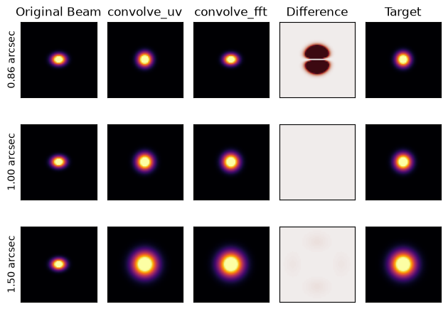

###########
convolve-uv
###########

``convolve-uv`` is a small Python package that allows for image convolution without loss of resolution.

When using something like ``convolve_fft`` in ``astropy``, you generate a kernel in the image domain, Fourier
transform (FT) it and the input image, and then perform the multiplication in the Fourier domain to carry out
the convolution. Whilst this works well for arbitrary kernels, when the kernel is small enough that the
pixel scale does not properly sample it, artefacts can be introduced or the convolution can fail. The way
around this is to pad out the kernel slightly so it is properly sampled, but this results in a loss of
resolution.

``convolve-uv`` takes a different approach, one that is useful for radio data when the beam of your data and
the convolution kernel are both Gaussian (which is almost always the case). This instead builds a transfer
function directly in :math:`uv`-space, and multiplies the FT of the image by this transfer function.
This means we can generate kernels that are not limited by the pixel scale of the image, and e.g. convolve
an elliptical to a round beam without any unnecessary loss of resolution.

To illustrate this, the Figure below shows a demonstration of ``convolve-uv`` compared to the ``astropy``
``convolve_fft``. The original beam here is elliptical (:math:`0.86^{\prime\prime} \times 0.65^{\prime\prime}`),
and so the round beam is :math:`0.86^{\prime\prime} \times 0.86^{\prime\prime}`. We see that ``convolve-uv``
successfully convolves the image to the round beam, while ``convolve_fft`` fails to do so due to the
undersampling of the kernel. For larger kernels (convolving to a :math:`1^{\prime\prime}` and :math:`1.5^{\prime\prime}`
beam), the two approaches give the same result.

.. toctree::
    :maxdepth: 2
    :caption: Documentation

    docs_convolve_uv/installation
    docs_convolve_uv/usage
    docs_convolve_uv/changelog
    docs_convolve_uv/reference_api

Indices and tables
==================

* :ref:`genindex`
* :ref:`modindex`
